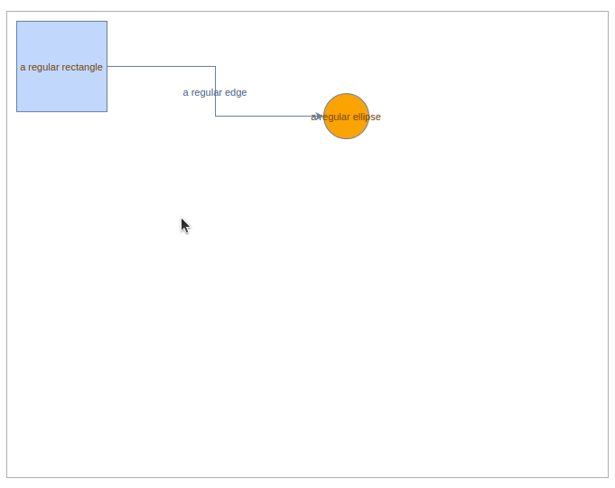

# maxGraph

<!-- next to come: npm and releases badge
[](https://www.npmjs.com/package/xxx)
-->
[](https://github.com/maxGraph/maxGraph/actions/workflows/build.yml)

maxGraph is a TypeScript library which can display and allow interaction with vector diagrams. At a high level, it provides: 
- **Nodes**, also known as **vertices** which are typically represented by shapes like rectangles.
- **Edges** which can be lines and arrows which normally point between one node and another.

It provides many of the diagramming features which would be expected by a piece of presentation software like Microsoft® PowerPoint™ or LibreOffice® Impress such as being able to resize, move or rotate nodes, but has a stronger focus on automatic layout algorithms and applications of [Graph Theory](https://en.wikipedia.org/wiki/Graph_theory). It is suited towards software which requires finer-grained customization of functionality than off-the-shelf packages.


The `maxGraph` library uses no third-party software, it requires no plugins and can be integrated in virtually any framework (it's vanilla JS).

`maxGraph` is the successor of [mxGraph](https://github.com/jgraph/mxgraph) which is now end of life.
At first, it provides the same features as mxGraph and adds
- TypeScript support
- maintained npm package
- modern modular, tree shakable, version of mxGraph to reduce the whole package size

New features will follow.


## Browser support

Chrome, Edge, Firefox, Safari, Chromium based browsers (Brave, Opera, ....) for mobile and desktop.

## Project status

maxGraph is under active development. An alpha version will be released soon (along with the npm package) once the [versioning](https://github.com/maxGraph/maxGraph/issues/92)
issue has been resolved.

In the meantime, you can test the project by running the [Storybook examples](#development) or [build the npm package locally](#build-local-npm-package).


## Getting Started

Assuming your page defines an element with the id `graph-container`, the following will display a rectangle connected to an orange circle.
```typescript
import {type CellStyle, Graph, InternalEvent} from '@maxgraph/core';

const container = <HTMLElement>document.getElementById('graph-container');
// Disables the built-in context menu
InternalEvent.disableContextMenu(container);

const graph = new Graph(container);
graph.setPanning(true); // Use mouse right button for panning
// Gets the default parent for inserting new cells. This
// is normally the first child of the root (ie. layer 0).
const parent = graph.getDefaultParent();

// Adds cells to the model in a single step
graph.batchUpdate(() => {
  const vertex01 = graph.insertVertex(parent, null, 'a regular rectangle', 10, 10, 100, 100);
  const vertex02 = graph.insertVertex(parent, null, 'a regular ellipse', 350, 90, 50, 50, <CellStyle>{shape: 'ellipse', fillColor: 'orange'});
  graph.insertEdge(parent, null, 'a regular edge', vertex01, vertex02);
});
```

You will see something like in the following _maxGraph panning_ demo:



For more details, have a look at the [storybook stories](packages/html/stories).


## TypeScript

maxGraph is written in TypeScript and provides type definitions so maxGraph can be easily integrated into TypeScript projects.

**WARN**: some definitions are currently buggy, so please set `skipLibCheck` to `true` in the `tsconfig.json` file of your project.
For more details, see issues [#96](https://github.com/maxGraph/maxGraph/issues/96) and [#105](https://github.com/maxGraph/maxGraph/issues/105#issuecomment-1240640369).


## Support

For usage question, please open a new [discussion](https://github.com/maxGraph/maxGraph/discussions/categories/q-a) on GitHub. You can also use
[GitHub discussions](https://github.com/maxGraph/maxGraph/discussions) for other topics like `maxGraph` development or to get the latest news.

Until we provide a complete documentation, you can check the mxGraph resources
- mxGraph documentation: [Github pages branch](https://jgraph.github.io/mxgraph/). The key resources are the JavaScript user manual, the JavaScript examples and the JavaScript API specification.
- [mxgraph tag on Stack Overflow](http://stackoverflow.com/questions/tagged/mxgraph). Please ensure your questions adhere to the [SO guidelines](http://stackoverflow.com/help/on-topic), otherwise it is likely to be closed.


## Migrating from mxGraph

**NOTE**: the following is only an indication of the migration. A more complete guide will be written in the future.

`maxGraph` APIs are not fully compatible with mxGraph APIs. The concepts are the same, so experienced mxGraph users should be able to switch from mxGraph to maxGraph without issues.

The main changes are the support removal of Internet Explorer (including VML support) and Legacy Edge.

### Migrating JavaScript projects

- The names of mxGraph objects were all prefixed by `mx`. The prefix has been dropped in maxGraph.
- Most names remain the same
- Some utility functions, whose implementation is natively available in modern versions of ECMAScript, have been removed.

### Migrating TypeScript projects

Remove the 
- `@typed-mxgraph/typed-mxgraph` dependency in the `package.json` file
- `typeroots` settings related to `typed-mxgraph` in the `tsconfig.json` file
- the mxGraph initialization code using the `factory` function

As an example, you can check [this project](https://github.com/tbouffard/maxgraph-integration-examples/tree/main/projects/rollup-ts) which has been migrated
from a [typed-mxgraph example](https://github.com/typed-mxgraph/typed-mxgraph-example-bundled-with-rollup).


## History

On 2020-11-09, the development on `mxGraph` stopped and `mxGraph` became effectively end of life.

On 2020-11-12, a fork of the `mxGraph` was created with a call to Contributors.

> 12 Nov 2020.
> 
> If you are interested in becoming a maintainer of mxGraph please comment on issue [#1](https://github.com/maxGraph/maxGraph/issues/1)
> 
> Initial objectives:
> 
> - The first priority is to maintain a working version of mxGraph and its **npm package**
> - The ambitious stretch goal is to refactor the codebase to create a modern modular, tree shakable, version of mxGraph to reduce the whole package size.
> 
> -- Colin Claverie

The project was then [renamed on 2021-06-02](https://github.com/maxGraph/maxGraph/discussions/47) into `maxGraph` due to [licensing issue](https://github.com/maxGraph/maxGraph/discussions/23).

Starting from the mxGraph 4.2.2 release, we
- moved code to ES9
- removed Internet Explorer specific code
- migrated to TypeScript, based on the work initiated in [typed-mxgraph](https://github.com/typed-mxgraph/typed-mxgraph)
- migrated the examples to [Storybook](https://storybook.js.org/)


## Development

### Setting up local development environment

In the project root directory, execute

```sh
$ npm install
```

To watch the core package, execute

```sh
$ npm run dev
```

and select `@mxgraph/core`.

To run the html(vanilla-js) version of [Storybook](https://storybook.js.org/), execute

```sh
$ npm run dev
```

and select `@mxgraph/html`.

Since both commands are in watch mode, so it's recommended to open two terminals and run them separately. When a file is saved from the core package, the html storybook will be automatically updated.


### <a id="build-local-npm-package"></a> Building the npm package for usage in external project

Run
- from the project root: `npm install`
- then, from the `packages/core` folder: `npm pack`

The `packages/core` folder or the generated `packages/core/maxgraph-core-***.tgz` file are now ready for use in an external project, using [npm link](https://docs.npmjs.com/cli/v8/commands/npm-link) or `npm install`.

Examples of use can be found in this [repository](https://github.com/tbouffard/maxgraph-integration-examples).
